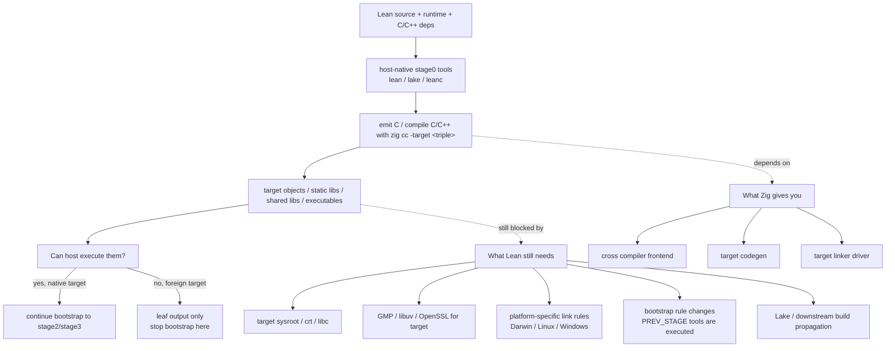

# Zig CC Integration Design

## Overview

This document describes the design for replacing Lean's existing C/C++ compilation
toolchain with `zig cc` / `zig c++` — Zig's built-in C/C++ compiler frontend — and
subsequently integrating the Zig code emission backend (`EmitZig`) into the Lean
compiler pipeline.

The work is split into two phases:

1. **Phase 1 — zig cc/c++ as the C/C++ compiler**: Make `leanc` and the CMake build
   system use `zig cc` and `zig c++` transparently as drop-in replacements for
   `cc`/`clang`/`gcc` and `clang++`/`g++`. This covers **both** C and C++ compilation
   — the entire build toolchain. No changes to code generation; Lean still emits C,
   but the C is compiled by Zig.

2. **Phase 2 — EmitZig backend**: Integrate the LCNF → Zig code emitter and Zig
   runtime into `src/`, enabling `lean -z` to produce Zig source files that are
   compiled and linked via `zig build` or `zig build-obj`/`zig build-exe`.

### Current status

Phase 1 is implemented and validated for the **host target only**. The current
toolchain wrappers execute:

```bash
zig cc "$@"
zig c++ "$@"
```

with no `-target` flag injected. This means each build directory still produces
artifacts for exactly one target: the host platform seen by CMake. On the current
development machine, the validated target is:

- `aarch64-apple-darwin`

A full bootstrap and full test run (`3926 / 3926`) passed for that host target.

Target expansion should therefore be treated as a **follow-on phase** to the
working host-native integration, not as something already implied by the existing
toolchain file.

---

## Phase 1: zig cc/c++ as the C/C++ Compiler

### 1.1 Current Architecture

The C/C++ compilation pipeline has five layers:

```
Lean source (.lean)
    │
    ▼  Compiler.LCNF.EmitC  (in-process, no external call)
C source (.c)
    │
    ▼  leanc wrapper
    │  ├── src/Leanc.lean      — production leanc binary (Lean)
    │  └── src/bin/leanc.in    — bash leanc for building Lean itself
    │
    ▼  IO.Process.spawn → external C compiler
    │  Compiler selection priority:
    │    1. LEAN_CC env var      (Leanc.lean:57)
    │    2. bundled clang in sysroot  (InstallPath.lean:264-265)
    │    3. CC env var           (InstallPath.lean:267)
    │    4. "cc" from PATH        (InstallPath.lean:270)
    │
    ▼  object file / executable
```

In parallel, the CMake build system compiles C++ sources directly:

```
src/{kernel,library,runtime,shell,util}/*.cpp
    │
    ▼  CMAKE_CXX_COMPILER (clang++/g++)
    │  project(LEAN CXX C)  — CMakeLists.txt:9
    │  Compiler ID check:  — CMakeLists.txt:250-270
    │    GNU → version check
    │    Clang → -D__CLANG__
    │    MSVC → MSVC flags
    │    else → FATAL_ERROR
    │
    ▼  object files → libleancpp.a, libleanshared.so, lean binary
```

#### Key files and their roles

| File | Role |
|------|------|
| `src/Leanc.lean` | Production `leanc` binary. Reads `LEAN_CC`, assembles flags, spawns compiler. |
| `src/bin/leanc.in` | Bash `leanc` template for building Lean itself. `${LEAN_CC:-@CMAKE_C_COMPILER@}`. |
| `src/Lean/Compiler/FFI.lean` | Lean bindings to CMake-configured flag strings. |
| `src/util/ffi.cpp` | C++ FFI: `@LEANC_EXTRA_CC_FLAGS@`, `@LEANC_INTERNAL_FLAGS@`, etc. |
| `src/lake/Lake/Config/InstallPath.lean` | Lake's compiler detection: `LEAN_CC` → bundled `clang` → `CC` → `cc`. |
| `src/lake/Lake/Build/Actions.lean` | `compileO`, `compileSharedLib`, `compileExe` — spawn compiler via `IO.Process.output`. |
| `src/lake/Lake/Build/Common.lean` | `buildLeanO`, `buildLeanSharedLib`, `buildLeanExe` — assemble args, call Actions. |
| `src/CMakeLists.txt` | CMake configuration: `project(LEAN CXX C)`, `LEANC_CC`, `LEANC_EXTRA_CC_FLAGS`, linker flags, compiler ID check. |
| `CMakeLists.txt` | Root CMake: stage0/stage1/stage2 orchestration, platform args forwarding. |
| `script/prepare-llvm-*.sh` | Cross-compilation scripts that override `CMAKE_C_COMPILER` and `LEANC_CC`. |

#### Flag assembly in leanc (src/Leanc.lean:62)

```
args = cflags ++ cflagsInternal ++ userArgs ++ ldflagsInternal ++ ldflags ++ ["-Wno-unused-command-line-argument"]
```

When `LEAN_CC` is set, `cflagsInternal` and `ldflagsInternal` are cleared (they are
for the bundled compiler only). This means a custom compiler receives only the
public flags (`cflags` + `ldflags`) plus user args.

### 1.2 Why zig cc / zig c++

Zig ships a C/C++ compiler frontend based on clang. It:

- Accepts gcc/clang-compatible CLI flags (with minor exceptions).
- Bundles its own LLD linker — no external `ld`/`lld` needed.
- Supports cross-compilation via `-target` triples out of the box.
- Ships libc for common targets (musl, mingw).
- Provides `zig cc` for C compilation and `zig c++` for C++ compilation.
- Is identified by CMake as `Clang` (via wrapper scripts), so the existing
  `CMAKE_CXX_COMPILER_ID MATCHES "Clang"` branch in `CMakeLists.txt:255` works
  without modification.

This makes it an ideal single-toolchain replacement for the current system that
requires `cc` + `clang++` + `lld` + platform sysroots.

### 1.3 Design: leanc changes

#### Problem: `IO.Process.spawn` with multi-word commands

`Leanc.lean:66` does:
```lean
let child ← IO.Process.spawn { cmd := cc, args, env }
```

If `LEAN_CC="zig cc"`, `cmd` becomes `"zig cc"` which `IO.Process.spawn` treats as
a single binary name — it fails because there is no binary literally named `"zig cc"`.

#### Solution: command splitting

Add a helper to split `LEAN_CC` into a command + leading args:

```lean
/-- Split a compiler command string into (cmd, extraArgs).
    "zig cc" → ("zig", ["cc"])
    "zig cc -target x86_64-linux" → ("zig", ["cc", "-target", "x86_64-linux"])
    "clang" → ("clang", []) -/
def splitCcCommand (cc : String) : String × Array String :=
  match cc.splitOn " " |>.filter (!·.isEmpty) with
  | [] => ("cc", #[])
  | [cmd] => (cmd, #[])
  | cmd :: rest => (cmd, rest.toArray)
```

Then in `main`:
```lean
if let some cc' ← IO.getEnv "LEAN_CC" then
  let (cmd, extraArgs) := splitCcCommand cc'
  cc := cmd
  -- prepend extraArgs to the final args array
  args := extraArgs ++ args
  cflagsInternal := #[]
  ldflagsInternal := #[]
```

And spawn becomes:
```lean
let child ← IO.Process.spawn { cmd, args := extraArgs ++ args, env }
```

This is fully backward-compatible: `LEAN_CC=clang` still works as before (single word,
no split).

#### macOS deployment target

`Leanc.lean:31-33` sets `MACOSX_DEPLOYMENT_TARGET=99.0` when unset, to suppress
linker warnings about newer system library versions. With `zig cc`, the target
is controlled via `-target` triple, so this env hack should be skipped when the
compiler is `zig`:

```lean
let env := match (← IO.getEnv "MACOSX_DEPLOYMENT_TARGET") with
  | some _ => #[]
  | none =>
    if isZigCc then #[]
    else #[("MACOSX_DEPLOYMENT_TARGET", "99.0")]
```

### 1.4 Design: Lake changes

`InstallPath.lean:260-270` `setCc` currently checks:

1. `LEAN_CC` env → custom CC
2. `leanCcExe sysroot` (bundled `bin/clang`) → internal CC
3. `CC` env → custom CC
4. `"cc"` → custom CC

No change needed here — setting `LEAN_CC="zig cc"` already flows through correctly.
But `Lake.Build.Actions` calls `IO.Process.output { cmd := compiler.toString, ... }`
which has the same multi-word command problem as `leanc`.

#### Fix in Actions.lean

`compileO`, `compileSharedLib`, and `compileExe` all pass `compiler.toString` as `cmd`.
Apply the same `splitCcCommand` logic:

```lean
-- In compileO
let (cmd, extraArgs) := splitCcCommand compiler.toString
proc {
  cmd := cmd,
  args := extraArgs ++ #["-c", "-o", oFile.toString, srcFile.toString] ++ moreArgs
}
```

The same pattern applies to `compileSharedLib` and `compileExe`.

### 1.5 Design: CMake changes — replacing both C and C++ compilers

#### CMake `project(LEAN CXX C)`

`src/CMakeLists.txt:9` declares `project(LEAN CXX C)`, which makes CMake detect both
the C and C++ compilers. The C++ compiler is used to build all of Lean's C++ sources:
the runtime (`src/runtime/*.cpp`), the kernel (`src/kernel/*.cpp`), the library
(`src/library/*.cpp`), the shell (`src/shell/*.cpp`), util (`src/util/*.cpp`),
and the FFI layer (`src/util/ffi.cpp`).

`CMakeLists.txt:250-270` has a hard-coded compiler ID check:

```cmake
if(CMAKE_CXX_COMPILER_ID MATCHES "GNU")       # g++
elseif(CMAKE_CXX_COMPILER_ID MATCHES "Clang") # clang++
elseif(MSVC)
else()
  message(FATAL_ERROR "Unsupported compiler: ${CMAKE_CXX_COMPILER_ID}")
endif()
```

#### Critical finding: CMake cannot call `zig` directly

CMake invokes the compiler binary with probe flags like `-arch arm64` (on macOS).
`zig` alone does not understand these — it needs the `cc` or `c++` subcommand first.
Setting `CMAKE_C_COMPILER=zig` produces: `error: unknown command: -arch` and fails.

#### Solution: wrapper scripts

Create two wrapper scripts that CMake calls as the C and C++ compilers:

```bash
# zig-cc  — C compiler wrapper
#!/bin/bash
exec zig cc "$@"

# zig-cxx — C++ compiler wrapper
#!/bin/bash
exec zig c++ "$@"
```

**Verified result** (tested with zig 0.16.0 on macOS arm64):

- `CMAKE_CXX_COMPILER_ID = Clang` ✅
- `CMAKE_C_COMPILER_ID = Clang` ✅
- `CMAKE_CXX_COMPILER_VERSION = 21.1.8` (zig 0.16's bundled clang version)
- CMake `project()` detection succeeds
- The `CMAKE_CXX_COMPILER_ID MATCHES "Clang"` branch is taken (line 255-256)
- `-D__CLANG__` is set correctly
- No `FATAL_ERROR`

This means the existing compiler ID check in `CMakeLists.txt:250-270` needs **no
modification** — zig's wrappers appear as Clang to CMake.

#### New CMake option

```cmake
# src/CMakeLists.txt
option(LEAN_USE_ZIG_CC "Use 'zig cc'/'zig c++' as C/C++ compiler instead of system cc/clang" OFF)

if(LEAN_USE_ZIG_CC)
  find_program(ZIG_EXE zig REQUIRED)

  # Create wrapper scripts in the build directory
  set(ZIG_CC_WRAPPER  "${CMAKE_BINARY_DIR}/zig-cc")
  set(ZIG_CXX_WRAPPER "${CMAKE_BINARY_DIR}/zig-cxx")
  file(WRITE "${ZIG_CC_WRAPPER}"  "#!/bin/bash\nexec \"${ZIG_EXE}\" cc \"$@\"\n")
  file(WRITE "${ZIG_CXX_WRAPPER}" "#!/bin/bash\nexec \"${ZIG_EXE}\" c++ \"$@\"\n")
  execute_process(COMMAND chmod +x "${ZIG_CC_WRAPPER}" "${ZIG_CXX_WRAPPER}")

  # Override both C and C++ compilers
  set(CMAKE_C_COMPILER   "${ZIG_CC_WRAPPER}"  CACHE FILEPATH "C compiler" FORCE)
  set(CMAKE_CXX_COMPILER "${ZIG_CXX_WRAPPER}" CACHE FILEPATH "C++ compiler" FORCE)
  set(LEANC_CC "${ZIG_CC_WRAPPER}" CACHE STRING "C compiler to use in leanc" FORCE)

  # zig bundles its own libc++ and lld — adjust linker config
  set(LEAN_CXX_STDLIB "")
  string(REPLACE "-fuse-ld=lld" "" LEAN_EXTRA_LINKER_FLAGS "${LEAN_EXTRA_LINKER_FLAGS}")
  set(LEAN_EXTRA_LINKER_FLAGS "${LEAN_EXTRA_LINKER_FLAGS}" CACHE STRING "" FORCE)
endif()
```

#### What this replaces

| Current compiler | Replaced by | Scope |
|------------------|-------------|-------|
| `CMAKE_C_COMPILER` (system `cc`/`clang`) | `zig-cc` wrapper → `zig cc` | All C compilation (leanc, runtime C files) |
| `CMAKE_CXX_COMPILER` (system `clang++`/`g++`) | `zig-cxx` wrapper → `zig c++` | All C++ compilation (kernel, library, runtime, shell, util) |
| `LEANC_CC` (set to `CMAKE_C_COMPILER`) | `zig-cc` wrapper | User-facing `leanc` after install |
| External `lld` | zig's bundled lld | All linking |
| `LEAN_CXX_STDLIB` (`-lstdc++`/`-lc++`) | empty (zig bundles libc++) | Linker stdlib flags |

#### leanc.in (bash wrapper)

`src/bin/leanc.in:10` uses `${LEAN_CC:-@CMAKE_C_COMPILER@}`. When `LEAN_USE_ZIG_CC=ON`,
`@CMAKE_C_COMPILER@` will be the `zig-cc` wrapper path. Bash handles this correctly
in the array form `(${LEAN_CC:-@CMAKE_C_COMPILER@} ...)` — no change needed.

For end users who don't have the wrapper, they can set `LEAN_CC="zig cc"` and the
`splitCcCommand` fix in `Leanc.lean` handles it.

#### Flag compatibility — C and C++

**C-only flags** (via `LEANC_EXTRA_CC_FLAGS`, used by `leanc` for user code):

| Flag | Source line | zig cc status | Action |
|------|-------------|---------------|--------|
| `-fstack-clash-protection` | :212 | Supported (clang backend) | None |
| `-ffp-contract=off` | :215 | Supported | None |
| `-fdata-sections -ffunction-sections` | :541,544 | Supported | None |
| `-fPIC` | :558,578 | Supported | None |
| `-fvisibility=hidden` | :596 | Supported | None |
| `-Wno-unused-command-line-argument` | Leanc.lean:62 | Supported | None |

**C++ flags** (via `CMAKE_CXX_FLAGS`, used to build Lean itself):

| Flag | Source line | zig c++ status | Action |
|------|-------------|-----------------|--------|
| `-std=c++20` | :274 | Supported | None |
| `-Wall -Wextra` | :274 | Supported | None |
| `-O3` (Release) | :282 | Supported | None |
| `-fPIC -ftls-model=initial-exec` | :557 | Supported | None |
| `-fvisibility=hidden -fvisibility-inlines-hidden` | :595 | Supported | None |
| `-ffp-contract=off` | :216 | Supported | None |
| `-D__CLANG__` | :256 | Set by CMake (Clang branch) | None |

**Linker flags**:

| Flag | Source line | zig/lld status | Action |
|------|-------------|-----------------|--------|
| `-fuse-ld=lld` | :48 | Redundant — zig bundles lld | Strip when zig |
| `-Wl,--start-group ... -Wl,--end-group` | :484 | lld supports it | Verify |
| `-Wl,-Bsymbolic` | :554 | lld supports it | Verify |
| `-Wl,--gc-sections` / `-Wl,-dead_strip` | :542,545 | lld supports it | Verify |
| `-Wl,-rpath=\\$$ORIGIN/..` | :559 | Supported | Verify |
| `-lstdc++` / `-lc++` | :507-514 | Still needed when invoking `zig cc` as the linker driver | Keep platform-specific stdlib flags (`-lc++` on Darwin) |
| `MACOSX_DEPLOYMENT_TARGET` | Leanc.lean / Lake Actions | N/A — zig target selection should come from `-target` | Skip environment hack when zig |

Most flags pass through unchanged. The ones needing conditional handling are:
1. `-fuse-ld=lld` — redundant, strip it.
2. `LEAN_CXX_STDLIB` — **do not** clear it; `zig cc` still needs explicit platform
   stdlib flags when it is used as the linker driver.
3. `MACOSX_DEPLOYMENT_TARGET` — skip the env hack in `leanc` and Lake when zig is active.

#### Cross-compilation strategy

Zig can target many architectures and ABIs, but Lean's build system is not organized
around arbitrary Zig triples. It has explicit platform families and feature branches
for:

- `Darwin`
- `Linux`
- `Windows`
- `Emscripten`

So "supporting Zig targets" should mean **expanding support within Lean's existing
platform model**, not claiming that every Zig target triple on Zig's platform support
page is automatically valid for Lean.

##### Zig upstream support levels

The upstream Zig support table is still the right starting filter. In particular:

- Zig **Tier 1** means the target is a primary upstream target.
- Zig **Tier 2** means the standard library, linker, libc, and CI support are all
  present.
- Zig **Tier 3/4** or "Additional Platforms" are much weaker signals; they are
  insufficient by themselves to justify Lean toolchain support.

That implies Lean should prioritize Zig Tier 1 and Tier 2 targets first, and only
then intersect them with Lean's own platform/runtime constraints.

##### Current implementation

The current implementation is **host-native only**. It supports
`-DLEAN_USE_ZIG_CC=ON` for replacing the host C/C++ compiler with `zig cc` /
`zig c++`, but it does not yet expose a user-facing target selector, and it
does not define a usable foreign-target bootstrap story.

In particular, it does not yet support:

- `LEAN_ZIG_TARGET`
- `CMAKE_C_COMPILER_TARGET`
- `CMAKE_CXX_COMPILER_TARGET`

as first-class inputs propagated through bootstrap, test, and downstream Lake
builds.

##### Recommended next interface

Add a single Lean-specific cache variable:

```cmake
-DLEAN_ZIG_TARGET=<zig-target-triple>
```

and treat `CMAKE_{C,CXX}_COMPILER_TARGET` as optional compatibility inputs. The
Zig wrappers should then become:

```bash
zig cc -target "$LEAN_ZIG_TARGET" "$@"
zig c++ -target "$LEAN_ZIG_TARGET" "$@"
```

For target-aware builds, this selector should also drive:

- `CMAKE_SYSTEM_NAME`
- `CMAKE_SYSTEM_PROCESSOR`
- target-specific linker / rpath / stdlib selections
- target-aware test and Lake environment propagation

`stage0` should stay host-native during the first rollout. Target-derived
platform arguments should only flow into the foreign-target `stage1` lane, not
into the shared root `PLATFORM_ARGS` path that also configures `stage0`.

##### Execution model: host tools, target artifacts first

The next step should **not** be "full foreign-target bootstrap". The practical
model is:

1. Keep `stage0` host-native.
2. Continue executing host-native previous-stage tools during bootstrap.
3. Use Zig's `-target` support to produce foreign-target objects, libraries,
   and executables.
4. Treat a foreign-target `stage1` as a **leaf output**.
5. Reject foreign-target `stage2+` until a separate host-tools / target-artifact
   bootstrap mode exists.

This follows directly from the current bootstrap structure: the stdlib build
invokes `PREV_STAGE/bin/lean` and `PREV_STAGE/bin/lake`, and `STAGE > 1` reuses
C++ artifacts from `PREV_STAGE`. A foreign-target `stage1` therefore cannot
currently become the bootstrap input for `stage2` on the host machine.

GitHub renders the following Mermaid diagram directly, so the full execution
flow is visible in the repository view as well:



##### Recommended rollout order

Start with a constrained target matrix aligned to both:

1. Zig's official Tier 1 / Tier 2 support table, and
2. Lean's existing Darwin/Linux/Windows/Emscripten code paths.

| Rollout wave | Zig target triple(s) | Why this wave comes here |
|--------------|----------------------|---------------------------|
| 1 | `x86_64-linux-gnu`, `aarch64-linux-gnu` | Lowest risk. Same Linux/ELF family, strongest overlap with existing standalone packaging and linker behavior. |
| 2 | `x86_64-linux-musl`, `aarch64-linux-musl` | Still Linux/ELF, but requires new musl sysroot and dependency packaging. |
| 3 | `x86_64-macos`, `aarch64-macos` | Same Zig target family as the host-validated path, but Mach-O, SDK, `install_name`, and `@rpath` handling raise the cost above Linux. |
| 4 | `x86_64-windows-gnu` | Highest native-OS cost among the near-term targets: PE/COFF, import libraries, DLL placement, ICU / SDK, and the existing multi-DLL split. |
| 5 | `wasm32-emscripten`, `wasm32-wasi` | Separate experimental track. Do not treat WASM as a normal extension of the native OS rollout. |

Targets such as `riscv64-linux`, `x86-freebsd`, or `aarch64-windows` may
eventually become reasonable follow-on candidates, but they should stay behind
the Linux/Darwin/Windows baseline until the initial rollout is stable.

##### Minimum OS expectations from Zig

Per Zig's upstream platform support page, the relevant baseline OS versions include:

- Darwin `14.0+`
- Linux kernel `5.10+`
- Windows `10+`

Lean's Zig target support should inherit these as lower bounds unless Lean itself
needs stricter ones.

##### Why WASM is separate

WASM is not just "one more Zig target". The repository already treats
`Emscripten` as a special platform:

- OpenSSL is disabled
- libuv is built differently
- Lake/shared-library targets are restricted or stubbed
- dynamic linking expectations differ
- `leanc` is not built in the existing Emscripten path

So WASM should be planned as an explicit experimental target family, not folded into
the initial generic cross-target rollout.

Likewise, Zig's "Additional Platforms" section (for example `wasm32-emscripten`,
`x86_64-fuchsia`, UEFI, freestanding, console, GPU, and embedded targets) should be
treated as **out of scope for the first cross-target implementation** unless Lean
gains explicit support for those runtime environments.

##### Roadmap phases

1. **Linux-only target selector + foreign `stage1` leaf scope**
   - add `LEAN_ZIG_TARGET`
   - inject `-target` into the Zig wrappers
   - keep `stage0` host-native
   - hard-error on foreign-target `STAGE > 1`
2. **Dedicated build-only cross smoke**
   - add one small cross-target verification path that emits C on the host,
     cross-compiles with Zig, links, and inspects the artifact architecture
   - do **not** run foreign target binaries
3. **Lake / downstream package propagation**
   - teach `lake env` / `lake build` to preserve the target-aware compiler
     selection
   - do not claim broad target support before this lands
4. **Build-only mode for compile suites**
   - add an explicit no-exec mode to `tests/compile*`
   - keep elab/server/doc suites native-host
5. **Family expansion**
   - Linux GNU
   - Linux musl
   - Darwin
   - Windows GNU
   - WASM separately

##### First implementation slice

The first PR should stay intentionally narrow:

- Linux-only `LEAN_ZIG_TARGET` plumbing
- foreign-target `stage1` as a supported **leaf build**
- one dedicated cross-smoke test
- explicit documentation that foreign `stage2+` is out of scope

The first PR should **not** attempt:

- foreign-target `stage2+`
- full CI matrix expansion
- downstream Lake propagation
- changes to the large native execution-heavy test suites
- any EmitZig backend work

##### Acceptance gates

The first cross-target slice is done when:

1. the existing native host Zig bootstrap still passes;
2. one foreign Linux `stage1` leaf build succeeds with `LEAN_ZIG_TARGET`;
3. a dedicated build-only cross smoke proves host-tool → target-artifact flow
   end to end; and
4. foreign-target `STAGE > 1` fails early with an explicit configuration error.

##### Appendix: Zig upstream targets outside the first Lean rollout

The following inventories are included so that future target work can be discussed
with explicit names instead of vague references to "Tier 3", "Tier 4", or
"Additional Platforms". **Listing a target here does not mean Lean supports it.**
It only means Zig has some documented level of upstream support for it.

###### Zig Tier 3 targets

These targets have Zig code generation and linker support, but are below the Tier 2
bar that we want for Lean's first cross-target rollout:

- `aarch64-haiku`
- `aarch64-ios`
- `aarch64-serenity`
- `aarch64-tvos`
- `aarch64-visionos`
- `aarch64-watchos`
- `arm-freebsd`
- `arm-haiku`
- `arm[eb]-linux`
- `arm[eb]-netbsd`
- `arm-openbsd`
- `mips64[el]-netbsd`
- `riscv64-haiku`
- `riscv64-serenity`
- `thumb[eb]-linux`
- `wasm64-wasi`
- `x86-freebsd`
- `x86-haiku`
- `x86-illumos`
- `x86_64-dragonfly`
- `x86_64-haiku`
- `x86_64-illumos`
- `x86_64-serenity`

For Lean, these are plausible **second-wave investigation candidates** only after
the Darwin/Linux/Windows Tier 1 rollout is stable.

###### Zig Tier 4 targets

These targets have weaker upstream support. They are useful to track, but should be
treated as far outside Lean's initial Zig target plan:

- `alpha-linux`
- `alpha-netbsd`
- `alpha-openbsd`
- `arc[eb]-linux`
- `csky-linux`
- `hppa-linux`
- `hppa-netbsd`
- `hppa-openbsd`
- `hppa64-linux`
- `m68k-linux`
- `m68k-netbsd`
- `m88k-openbsd`
- `microblaze[el]-linux`
- `or1k-linux`
- `sh[eb]-linux`
- `sh[eb]-netbsd`
- `sh-openbsd`
- `sparc-linux`
- `sparc-netbsd`
- `sparc64-linux`
- `sparc64-netbsd`
- `sparc64-openbsd`
- `xtensa[eb]-linux`

Lean should not target these until there is a concrete downstream need and a clear
plan for runtime, libc, linker, and CI coverage.

###### Zig Additional Platforms

Zig also documents a large "Additional Platforms" set where the normal tier system
does not fully apply. For Lean, these should be considered **explicitly out of
scope** for the first cross-target implementation unless we add platform-specific
runtime and build support.

**Apple / kernel / alternate OS targets**

- `aarch64-driverkit`
- `aarch64-fuchsia`
- `aarch64-hurd`
- `aarch64-uefi`
- `arm-fuchsia`
- `arm-uefi`
- `loongarch(32,64)-uefi`
- `riscv(32,64)-uefi`
- `riscv64-fuchsia`
- `thumb-fuchsia`
- `x86[_64]-hurd`
- `x86[_64]-uefi`
- `x86_64-driverkit`
- `x86_64-fuchsia`
- `x86_64-plan9`

**Freestanding / bare-metal targets**

- `aarch64[_be]-freestanding`
- `alpha-freestanding`
- `arc[eb]-freestanding`
- `arm[eb]-freestanding`
- `avr-freestanding`
- `bpf(eb,el)-freestanding`
- `csky-freestanding`
- `ez80-freestanding`
- `hexagon-freestanding`
- `hppa[64]-freestanding`
- `kalimba-freestanding`
- `kvx-freestanding`
- `lanai-freestanding`
- `loongarch(32,64)-freestanding`
- `m68k-freestanding`
- `m88k-freestanding`
- `microblaze[el]-freestanding`
- `mips[64][el]-freestanding`
- `msp430-freestanding`
- `or1k-freestanding`
- `powerpc[64][le]-freestanding`
- `propeller-freestanding`
- `riscv(32,64)[be]-freestanding`
- `s390x-freestanding`
- `sh[eb]-freestanding`
- `sparc[64]-freestanding`
- `thumb[eb]-freestanding`
- `ve-freestanding`
- `wasm(32,64)-freestanding`
- `x86[_16,_64]-freestanding`
- `xcore-freestanding`
- `xtensa[eb]-freestanding`

**Console / handheld / device targets**

- `arm-3ds`
- `arm-vita`
- `ez80-tios`
- `mipsel-psx`
- `mipsel-psp`
- `powerpc-wiiu`
- `powerpc64-ps3`
- `thumb-vita`
- `x86_64-ps4`
- `x86_64-ps5`

**GPU / accelerator / shader targets**

- `amdgcn-amdhsa`
- `amdgcn-amdpal`
- `amdgcn-mesa3d`
- `nvptx[64]-cuda`
- `nvptx[64]-nvcl`
- `spirv(32,64)-opencl`
- `spirv(32,64)-opengl`
- `spirv(32,64)-vulkan`

**WASM special-case targets**

- `wasm(32,64)-emscripten`

These names are documented here so future planning discussions can be concrete, but
they should not be added to Lean's supported target matrix without dedicated design
work for their runtime and packaging model.

### 1.6 Design: Testing

#### Test matrix

| Test | What it verifies |
|------|-----------------|
| `LEAN_CC="zig cc" leanc --print-cflags` | Flag output is correct for host-native Zig builds |
| `LEAN_CC="zig cc" leanc --print-ldflags` | Linker flag output is correct for host-native Zig builds |
| `LEAN_CC="zig cc" leanc -c test.c -o test.o` | Host-native object file compilation |
| `LEAN_CC="zig cc" leanc test.o -o test` | Host-native executable linking |
| `cmake -DLEAN_USE_ZIG_CC=ON .. && make` | Full host-native bootstrap (C + C++ via Zig) |
| `make test` | Full host-native test suite passes |
| `lean --c=test.c test.lean` | L0 cross-target smoke: host tool emits C for a foreign-target flow |
| `zig cc -target <triple> -c test.c -o test.o && zig cc -target <triple> test.o -o test.out` | L1 cross-target smoke: target compile + link succeeds |
| dedicated `tests/cross_verify` smoke | Host-tool → target-artifact flow succeeds without executing the target binary |
| build-only `compile*` mode (future) | L2 cross-target suite coverage for compile paths without host execution |

#### Regression strategy

1. Keep the current host-native Zig bootstrap green.
2. Add a dedicated build-only cross smoke before modifying the large native suites.
3. For foreign targets, verify compile success, link success, and artifact identity (`file`, symbol tables, archive inspection), not binary execution.
4. Only run the full binary-executing test suite for native targets.
5. Treat Lake/downstream package builds as a separate verification phase, not as an automatic consequence of bootstrap support.

#### Implementation order

##### Phase 1 (implemented)

1. Add Zig wrapper-based host compiler replacement.
2. Handle multi-word `LEAN_CC` and Zig-specific linker quirks.
3. Build the host-native Zig bootstrap and run the full host test suite.

##### Phase 1b (next PR)

1. Add `LEAN_ZIG_TARGET`.
2. Restrict the first rollout to Linux targets.
3. Keep `stage0` host-native and foreign `stage1` leaf-only.
4. Inject `-target` into the Zig wrappers and `leanc`.
5. Add one dedicated build-only cross smoke.

##### Phase 1c

1. Propagate the target-aware toolchain through Lake/downstream builds.
2. Add explicit build-only / skip-exec coverage to `tests/compile*`.
3. Expand from Linux GNU to Linux musl.

##### Phase 1d

1. Extend the same model to Darwin.
2. Extend the same model to Windows GNU.
3. Keep Emscripten / WASM on a separate experimental track.

---

## Phase 2: EmitZig Backend

### 2.1 Current State

The Zig code emission backend has been developed on the `zig-backend-codegen` and
related branches. It exists in the build tree (`build/release/stage*/src/lean/...`)
but has not been merged into `src/`. The following components are ready:

#### Code emission

| Component | Location (build tree) | Description |
|-----------|------------------------|-------------|
| `EmitZig.lean` | `Lean/Compiler/LCNF/EmitZig.lean` | 1689 lines. LCNF → Zig source. |
| `EmitZig/InlineHelpers.lean` | Same dir | Inline helper utilities. |
| `EmitZig/RuntimeExterns.lean` | Same dir | ~1260 lines. Auto-generated runtime extern declarations. |

#### Shell integration

`Shell.lean` (build tree) already has:
- `import Lean.Compiler.LCNF.EmitZig` (:16)
- `emitZig` function (:62-65)
- `zigFileName?` option field (:265)
- `-z` / `--zig=fname` CLI flag (:351-352)
- Zig code generation path (:605-611)

#### Zig runtime

`runtime/zig/` contains 120+ `.zig` files implementing the Lean runtime in pure Zig:

- `build.zig` — Zig build system entry point, accepts leanc flags as options.
- `root.zig` / `root_zigrt.zig` — runtime roots (full and zigrt-only).
- `lean_object.zig` — Lean object ABI.
- `allocator.zig` — pluggable allocator (mimalloc compat, libc-backed).
- `kernel.zig`, `inductive.zig`, `type_checker.zig` — kernel ported to Zig.
- `io_min.zig`, `uv_*.zig` — IO and libuv subsystems.
- `object.zig`, `string.zig`, `array.zig` — Lean data structures.
- `task.zig`, `task_manager.zig` — task scheduling.

`build.zig` already accepts CMake flag options:
```
--leanc-extra-cc-flags, --leanc-internal-flags,
--leanc-static-linker-flags, --leanc-shared-linker-flags,
--leanc-internal-linker-flags, --lean-extra-linker-flags
```

#### Tests

20+ emitzig-zigrt tests exist: `Array`, `Cases`, `Closure`, `Exception`, `Float`,
`FloatArray`, `InlineHelpers`, `JoinPoint`, `List`, `Loop`, `LoopControl`,
`MixedScalar`, `Nat`, `Recursion`, `SetStdout`, `Smoke`, `Stderr`, `String`,
`StringEscapes`, `StringHelpers`.

### 2.2 Design: Merge EmitZig into src/

#### Files to add

```
src/Lean/Compiler/LCNF/EmitZig.lean
src/Lean/Compiler/LCNF/EmitZig/InlineHelpers.lean
src/Lean/Compiler/LCNF/EmitZig/RuntimeExterns.lean
src/runtime/zig/                      (120+ .zig files)
src/runtime/zig/build.zig
```

#### Module wiring

`src/Lean/Compiler/LCNF.lean` needs:
```lean
public import Lean.Compiler.LCNF.EmitZig
public import Lean.Compiler.LCNF.EmitZig.InlineHelpers
public import Lean.Compiler.LCNF.EmitZig.RuntimeExterns
```

`src/Lean/Shell.lean` needs:
```lean
import Lean.Compiler.LCNF.EmitZig

def emitZig (mainModuleName : Name) (env : Environment) : IO String := do
  let data ← EmitZig.emitZig mainModuleName
    |>.toIO' { fileName := "<emitZig>", fileMap := default } { env }
  return data
```

And in the option parsing:
```lean
-- -z, --zig=fname
| 'z' => return {opts with zigFileName? := ← checkOptArg "z" optArg?}
```

And in the main compilation flow:
```lean
if let some z := opts.zigFileName? then
  let .ok out ← IO.FS.Handle.mk z .write |>.toBaseIO
    | IO.eprintln s!"failed to create '{z}'"
      return 1
  profileitIO "Zig code generation" opts.leanOpts do
    let data ← emitZig mainModuleName env
    out.write data.toUTF8
```

### 2.3 Design: Zig compilation pipeline

After `lean -z` emits a `.zig` file, it needs to be compiled. Two approaches:

#### Approach A: zig build-obj / build-exe (simple)

```bash
# Compile .zig to object file
zig build-obj -fno-emit-bin -fPIC -c -o output.o input.zig

# Or directly to executable
zig build-exe -lc -lcpp input.zig -lleanrt_zig -L$LEAN_LIB_DIR
```

This mirrors how `leanc` works for C: emit code, then compile with zig.

#### Approach B: zig build system (structured)

Use `runtime/zig/build.zig` which already defines modules, options, and library
targets. This is the approach used by the emitzig test infrastructure.

For user-facing compilation, Approach A is simpler and more compatible with the
existing `leanc` model. The `build.zig` system is used for building the Zig runtime
itself and for the emitzig test suite.

#### New tool: `leanzigc`

Analogous to `leanc`, a `leanzigc` wrapper that:

1. Takes emitted `.zig` files and compiles them using `zig build-obj` / `zig build-exe`.
2. Passes the correct include dirs and library paths.
3. Links against `libleanrt_zig.a` (the Zig runtime archive).

This could be a Lean binary (like `Leanc.lean`) or a shell script (like
`src/bin/leanc.in`). Given that the logic is simpler (zig is self-contained),
a shell script is sufficient initially.

### 2.4 Design: CMake integration for Zig runtime

```cmake
# src/CMakeLists.txt
option(LEAN_ZIG_RUNTIME "Build the Lean runtime in Zig instead of C++" OFF)

if(LEAN_ZIG_RUNTIME)
  find_program(ZIG_EXE zig REQUIRED)
  set(ZIG_BUILD_DIR "${CMAKE_BINARY_DIR}/zig-runtime")

  # Build the Zig runtime archive
  add_custom_command(
    OUTPUT ${ZIG_BUILD_DIR}/libleanrt_zig.a
    COMMAND ${ZIG_EXE} build
      --prefix ${ZIG_BUILD_DIR}
      -Doptimize=ReleaseFast
      -Dlean-include-dir=${CMAKE_SOURCE_DIR}/include
      -Dleanc-extra-cc-flags=${LEANC_EXTRA_CC_FLAGS}
      -Dleanc-internal-flags=${LEANC_INTERNAL_FLAGS}
      -Dleanc-static-linker-flags=${LEANC_STATIC_LINKER_FLAGS}
      -Dleanc-shared-linker-flags=${LEANC_SHARED_LINKER_FLAGS}
      -Dleanc-internal-linker-flags=${LEANC_INTERNAL_LINKER_FLAGS}
      -Dlean-extra-linker-flags=${LEAN_EXTRA_LINKER_FLAGS}
    WORKING_DIRECTORY ${CMAKE_SOURCE_DIR}/src/runtime/zig
    DEPENDS ${CMAKE_SOURCE_DIR}/src/runtime/zig/build.zig
  )

  # Replace C++ runtime targets with Zig archive
  set(LEANRT_LIB ${ZIG_BUILD_DIR}/libleanrt_zig.a)
  set(LEANRT_LIB_ZIGRT ${ZIG_BUILD_DIR}/libleanrt_zig_zigrt.a)
endif()
```

### 2.5 Design: Testing for EmitZig

#### In-tree tests

The existing emitzig test suite should be moved to `tests/emitzig/`:

```
tests/emitzig/
  run_test.sh          — test driver
  Array.lean           — test Lean code
  Cases.lean
  Closure.lean
  ...
```

Each test:
1. Runs `lean -z input.zig -c` to emit both C and Zig (or Zig only).
2. Compiles the Zig with `zig build-exe` linking against the Zig runtime.
3. Runs the executable and checks output against expected.

#### CMakeLists.txt integration

```cmake
# tests/CMakeLists.txt
add_test_pile(emitzig emitzig "Lean → Zig codegen tests")
```

### 2.6 Implementation order for Phase 2

1. Copy `EmitZig.lean`, `EmitZig/InlineHelpers.lean`, `EmitZig/RuntimeExterns.lean`
   into `src/Lean/Compiler/LCNF/`.
2. Copy `runtime/zig/` (120+ files) into `src/runtime/zig/`.
3. Add module imports to `src/Lean/Compiler/LCNF.lean`.
4. Add `-z` flag, `zigFileName?`, and `emitZig` to `src/Lean/Shell.lean`.
5. Add `LEAN_ZIG_RUNTIME` CMake option and `add_custom_command` for building the
   Zig runtime.
6. Copy emitzig tests to `tests/emitzig/` and wire into `tests/CMakeLists.txt`.
7. Build with `cmake -DLEAN_ZIG_RUNTIME=ON -DLEAN_USE_ZIG_CC=ON` and run tests.
8. Run `make update-stage0` to snapshot the new source files into `stage0/`.

---

## Combined Build Flow

When both phases are active (`LEAN_USE_ZIG_CC=ON` + `LEAN_ZIG_RUNTIME=ON`):

```
Lean source (.lean)
    │
    ├─ -c flag ──▶ EmitC  ──▶ .c  ──▶ leanc (zig cc) ──▶ .o ──┐
    │                                                         ├──▶ executable
    └─ -z flag ──▶ EmitZig ──▶ .zig ──▶ zig build-exe ──▶ .o ─┘
                                    + libleanrt_zig.a
```

The C and Zig backends can coexist. Users choose via `-c` or `-z`. The runtime
library is either the C++ `libleanrt.a` or the Zig `libleanrt_zig.a`, selected
at CMake configure time.

---

## Risk Assessment

| Risk | Impact | Mitigation |
|------|--------|------------|
| `zig cc`/`zig c++` flag incompatibility | Build failure | Flag compatibility tables above; all critical flags verified |
| `IO.Process.spawn` multi-word cmd | leanc crashes | `splitCcCommand` helper handles this |
| CMake cannot use `zig` directly | CMake configure fails | Wrapper scripts (`zig-cc`, `zig-cxx`) — verified working |
| Zig runtime ABI mismatch | Link failures | Runtime externs auto-generated from C++ headers |
| Bootstrap breakage | Cannot build Lean | Zig features gated behind `LEAN_USE_ZIG_CC`/`LEAN_ZIG_RUNTIME` options; default OFF |
| stage0 incompatibility | Bootstrap fails | stage0 remains C-only; Zig features only in stage1+ |
| ccache incompatibility | Slower rebuilds | `zig cc` works with ccache via `CCACHE_COMPILER` or wrapper |
| C++ stdlib mismatch | Link failures | `LEAN_CXX_STDLIB=""` when zig; zig bundles libc++ |

## Decisions

| Decision | Choice | Rationale |
|----------|--------|-----------|
| zig cc/c++ integration approach | Wrapper scripts + CMake option | CMake cannot call `zig` directly; wrappers make it appear as Clang |
| Wrapper script location | `${CMAKE_BINARY_DIR}/` | Auto-generated; no repo pollution |
| Multi-word command handling (leanc) | `splitCcCommand` helper | Minimal change; backward compatible |
| EmitZig merge strategy | Copy into `src/`, gate behind CMake option | Keeps master clean; opt-in |
| Zig runtime build | `zig build` via `add_custom_command` | Uses existing `build.zig`; no custom CMake for Zig |
| Default state | Both features OFF | No impact on existing builds until explicitly enabled |