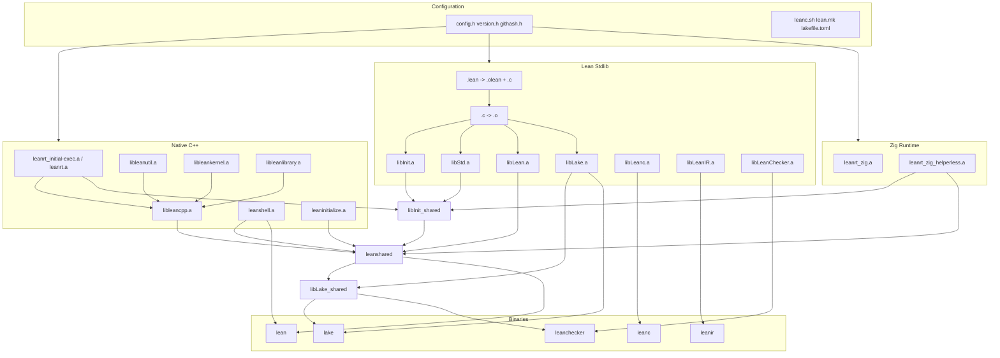

# Unified `build.zig` Architecture for Lean 4

## 1. Current Flow Analysis

### 1.1 Build Orchestration

Lean 4 currently uses a three-tier build system:

1. **Root `CMakeLists.txt`** – bootstrap orchestrator.
   - Discovers/provisions host tools: `cadical`, `leantar`, `mimalloc`.
   - Declares `ExternalProject_Add` for `stage0`, `stage1`, `stage2`, `stage3`.
   - Forwards command-line variables to stages via `CL_ARGS`, `STAGE0_ARGS`, `STAGE1_ARGS`, `PLATFORM_ARGS`.
   - Provides convenience targets: `test`, `update-stage0`, `bench`, `check-stage3`.

2. **`src/CMakeLists.txt`** – per-stage build.
   - Configures C++ compiler flags, platform detection, `LEAN_PLATFORM_TARGET`.
   - Adds subdirectories: `runtime`, `util`, `kernel`, `library`, `initialize`, `shell`.
   - Builds `libleanrt_initial-exec.a`, `libleanrt.a`, `libleancpp_1.a`, `libleancpp.a`, `leanshell.a`, `leaninitialize.a`.
   - Configures and invokes `stdlib.make` (from `src/stdlib.make.in`) to compile `Init`, `Std`, `Lean`, `Lake`, `Leanc`, `LeanIR`, `LeanChecker`.
   - Links shared libraries `libInit_shared.so`, `libleanshared.so`, `libLake_shared.so` and executables `lean`, `lake`, `leanc`, `leanir`, `leanchecker`.
   - Generates `leanc.sh`, `lean.mk`, `lakefile.toml`, headers (`config.h`, `version.h`, `githash.h`).

3. **`src/runtime/zig/CMakeLists.txt`** + **`src/runtime/zig/build.zig`** – experimental Zig runtime.
   - `build.zig` builds `libleanrt_zig.a` from pure-Zig sources plus a small C bridge.
   - CMake invokes `zig build` twice: once with full exports and once helperless for linking into `leanshared`.
   - During Phase 2/3 cutover, Python scripts `tools/weaken_zig_symbols.py` and `tools/flip_to_zig.py` mutate Mach-O archives to resolve duplicate symbols between Zig and C++.

4. **`src/stdlib.make.in`** + **`src/lean.mk.in`** – stdlib compilation.
   - `lean.mk` compiles `.lean` files to `.olean` + `.c` using the previous stage `lean`, then compiles `.c` to `.o` via `leanc` (`leanc.sh`).
   - `stdlib.make` wraps `lean.mk` for core packages and adds shared-library/exe link rules.

5. **Tools/scripts**.
   - `tools/zigc`, `tools/zigc-stdlib` – ad-hoc Zig compilation of Lean drivers.
   - `tools/weaken_zig_symbols.py`, `tools/flip_to_zig.py`, `tools/phase3_flip_symbols.txt` – symbol strength manipulation.
   - `script/lib/update-stage0` – copies generated C sources into `stage0/`.

### 1.2 Bootstrap Model

- **stage0**: pre-built snapshot in `stage0/`. Built with `STAGE=0`, `USE_GITHASH=OFF`. It produces the first working `lean` binary and the generated `.c` files for the stdlib.
- **stage1**: built with `STAGE=1`, `PREV_STAGE=build/stage0`. Recompiles the compiler and stdlib using the stage0 binary.
- **stage2/stage3**: optional verification stages; `check-stage3` compares `stage2/bin/lean` and `stage3/bin/lean`.

### 1.3 Key Outputs

| Output | Source | Consumers |
|--------|--------|-----------|
| `lean` (exe) | `shell/lean.cpp` + `leanshell.a` + `leanmain.a` + `leanshared` | users |
| `libleanshared.so` | `libLean.a.export`, `libleancpp*.a`, `leanshell.a`, `leaninitialize.a`, runtime | `lean`, `lake`, plugins |
| `libInit_shared.so` | empty/shared on Unix; real DLL on Windows | `leanshared` |
| `libLake_shared.so` | `libLake.a.export` | `lake`, `leanchecker` |
| `libleanrt_initial-exec.a` | C++ runtime objects | `leanshared` |
| `libleanrt.a` | C++ runtime objects (`local-exec`) | static `leanc` links |
| `libleanrt_zig.a` | Zig runtime | helperless link into `leanshared` |
| `libleancpp.a` | util + kernel + library objects | `leanshared`, static links |
| `libInit.a`, `libStd.a`, `libLean.a` | Lean stdlib `.o` archives | `leanshared`, static links |
| `leanc.sh` | configured shell wrapper | `lean.mk`, stdlib link |

---

## 2. Proposed Architecture: A Single `build.zig`

The new build is a single `build.zig` at the repository root. It replaces CMake, Make, and the Python symbol scripts while preserving the exact bootstrap semantics and output layout.

### 2.1 High-Level Structure

```zig
pub fn build(b: *std.Build) void {
    // configuration
    const stage = b.option(u2, "stage", "Bootstrap stage (0/1/2/3)") orelse 1;
    const prev_stage = b.option([]const u8, "prev-stage", "Path to previous stage build dir");
    const target = b.standardTargetOptions(.{});
    const optimize = b.standardOptimizeOption(.{});
    const use_gmp = b.option(bool, "use-gmp", "Use libgmp") orelse true;
    const use_mimalloc = b.option(bool, "use-mimalloc", "Use mimalloc") orelse true;
    const lean_zig_runtime = b.option(bool, "lean-zig-runtime", "Build Zig runtime") orelse true;
    const lean_zig_rt_cutover = b.option(bool, "lean-zig-rt-cutover", "Link Zig runtime into leanshared") orelse true;

    // toolchain discovery
    const lean = discoverPrevStageLean(b, prev_stage, stage);
    const cadical = discoverCadical(b);
    const leantar = discoverLeantar(b);
    const gmp = discoverGmp(b, target);
    const uv = discoverLibUv(b, target);

    // generated headers
    const config_h = generateConfigHeader(b, stage, use_mimalloc);
    const version_h = generateVersionHeader(b);
    const githash_h = generateGithashHeader(b, stage);

    // native runtime / compiler libraries
    const leanrt_initial_exec = buildLeanRtInitialExec(b, target, optimize, uv, gmp);
    const leanrt = buildLeanRt(b, target, optimize, uv, gmp);
    const util = buildUtil(b, target, optimize);
    const kernel = buildKernel(b, target, optimize);
    const library = buildLibrary(b, target, optimize);
    const leancpp = buildLeanCpp(b, target, optimize, util, kernel, library);
    const leanshell = buildLeanShell(b, target, optimize);
    const leaninitialize = buildLeanInitialize(b, target, optimize);

    // zig runtime
    const leanrt_zig = if (lean_zig_runtime) buildLeanrtZig(b, target, .helperless) else null;

    // stdlib (Init/Std/Lean/Lake/...)
    const stdlib = buildStdlib(b, .{
        .lean = lean,
        .packages = &.{ "Init", "Std", "Lean", "Lake", "Leanc", "LeanIR", "LeanChecker" },
        .leanc = leanc_sh,
    });

    // shared libraries and executables
    const init_shared = buildInitShared(b, stdlib.init, stdlib.std, leanrt_initial_exec, leanrt_zig);
    const leanshared = buildLeanShared(b, init_shared, stdlib.lean, leancpp, leanshell, leaninitialize, leanrt_zig);
    const lake_shared = buildLakeShared(b, leanshared, stdlib.lake);

    const lean_exe = buildLeanExe(b, init_shared, leanshared, leanmain);
    const lake_exe = buildLakeExe(b, lake_shared, stdlib.lake_main);
    const leanc_exe = buildLeancExe(b, stdlib.leanc);
    const leanir_exe = buildLeanirExe(b, stdlib.leanir);
    const leanchecker_exe = buildLeancheckerExe(b, lake_shared, stdlib.lean_checker);

    installArtifacts(b);
    addTestStep(b, stage);
}
```

### 2.2 Build Steps as Zig Modules

To keep the root file readable, split the build into modules under `build/zig/` (new directory):

- `build/zig/Config.zig` – option parsing, platform detection, flag derivation.
- `build/zig/Native.zig` – C++ source compilation using `std.Build.Step.Compile`.
- `build/zig/Runtime.zig` – Zig runtime build (wraps `src/runtime/zig/build.zig`).
- `build/zig/Stdlib.zig` – Lean stdlib compilation: `.lean` -> `.olean` + `.c` -> `.o`.
- `build/zig/Link.zig` – shared libraries and executables.
- `build/zig/Symbols.zig` – archive symbol inspection and manipulation.
- `build/zig/Cross.zig` – cross-compilation helpers.

### 2.3 Native C++ Build (`zig cc`)

All C/C++ compilation goes through `b.addObject()` / `b.addStaticLibrary()` / `b.addExecutable()` with the C/C++ source files. Zig build uses `zig cc`/`zig c++` automatically when `link_libc = true`. This unifies the compiler toolchain and removes the CMake compiler-detection dance.

Example:

```zig
const runtime = b.addStaticLibrary(.{
    .name = "leanrt_initial-exec",
    .target = target,
    .optimize = optimize,
    .link_libc = true,
});
runtime.addCSourceFiles(.{
    .files = &.{
        "src/runtime/debug.cpp",
        "src/runtime/thread.cpp",
        // ...
    },
    .flags = flags,
});
runtime.linkSystemLibrary("uv", .{});
if (use_gmp) runtime.linkSystemLibrary("gmp", .{});
```

Flags derived from current CMake:

- `-std=c++20`, `-Wall`, `-Wextra`
- `-DLEAN_BUILD_TYPE=...`, `-DLEAN_EXPORTING`
- `-DLEAN_MULTI_THREAD` (default)
- `-fPIC`/`-ftls-model=initial-exec` on Linux, `-ftls-model=initial-exec` on Darwin
- `-fstack-clash-protection`, `-ffp-contract=off`
- `-fdata-sections -ffunction-sections`, `--gc-sections`/`-dead_strip`
- Platform-specific: `-DLEAN_WINDOWS`, `-DLEAN_EMSCRIPTEN`, etc.

### 2.4 Zig Runtime Build

The existing `src/runtime/zig/build.zig` becomes a dependency of the unified build. The root `build.zig` calls it via `b.createModule()` and `std.Build.child` invocation, or by importing it as a submodule. For simplicity and to preserve its standalone testability, keep it as a separate build file and invoke it with `b.addSystemCommand(&.{"zig", "build", ...})` or use `std.Build.Dependency` if it is published as a local package.

Two variants are produced:

1. **Full-export `libleanrt_zig.a`** – for standalone Zig targets/tests.
2. **Helperless `libleanrt_zig.a`** – linked into `leanshared`.

### 2.5 Stdlib Build (`.lean` -> `.c` -> `.o`)

This is the most complex part of the current Make flow. Implement it as a custom Zig build step that emits a DAG of per-file compile steps.

#### 2.5.1 Dependency Discovery

For each package (e.g. `Init`), discover `.lean` files. For each file:

1. Run `${prev_stage}/bin/lean --deps src/Init/Foo.lean` to get direct dependencies.
2. Create a `std.Build.Step` for the `.olean` output that depends on the `.olean` outputs of its dependencies.
3. Create a `std.Build.Step` for the `.c` output that depends on the `.olean`.
4. Create a `std.Build.Step.Compile` for the `.o` output that compiles the `.c` with `zig cc`.

Zig build handles parallel scheduling automatically.

#### 2.5.2 Options Passed to `lean`

- `-o <OLEAN_OUT>/<module>.olean`
- `-i <OLEAN_OUT>/<module>.ilean`
- `--c=<TEMP_OUT>/<module>.c`
- `LEAN_PATH=<OLEAN_OUT>`
- Extra options from configuration: `-s40000` on Darwin, `LLVM=1` flags, etc.

#### 2.5.3 Options Passed to `zig cc`

- `-I <build>/include`, `-I src/`, `-DLEAN_EXPORTING`
- Build-type flags (`-O3 -DNDEBUG` for Release, `-g3` for Debug, etc.)
- `-fstack-clash-protection`, `-ffp-contract=off`

#### 2.5.4 Lake Mode

When `USE_LAKE=ON` (default for stage 1+), Lake builds the stdlib. The unified build should still support Lake invocation but also implement a pure-Zig fallback for bootstrapping environments where Lake is not yet available. The pure-Zig fallback is required for the no-CMake/Make replacement to be complete.

### 2.6 Linking

Implement link rules matching `stdlib.make.in`:

- **Static archives**: use `ar` via Zig's built-in static-library steps, or `zig ar`.
- **Shared libraries**: use `b.addSharedLibrary()` with the appropriate flags.
- **Executables**: use `b.addExecutable()`.

For Unix platforms, `libInit_shared.so` and the `leanshared_*` intermediates are mostly empty or minimal on non-Windows; replicate that behavior to avoid symbol-limit indirection. For Windows, implement the multi-DLL split exactly as in `stdlib.make.in`.

### 2.7 Symbol Management Without Python

The current Phase 2/3 cutover uses Python to weaken/unweaken Mach-O symbols. Replace this with a small Zig tool compiled and run during the build.

#### 2.7.1 Tool: `build/zig/tools/macho_symbols.zig`

A self-contained Zig program that:

1. Reads a list of Mach-O static archives.
2. Extracts defined external `_lean_*` symbols.
3. For **weaken**: marks matching Zig symbols as weak (`N_WEAK_DEF`).
4. For **flip**: weakens C++ symbols and unweakens Zig symbols for a given allow-list.

The root `build.zig` compiles this tool once and runs it as a build step on the helperless Zig archive and the C++ archives.

```zig
const weaken_step = b.addRunArtifact(macho_symbols);
weaken_step.addArg("weaken");
weaken_step.addFileArg(leanrt_zig_helperless);
weaken_step.addFileArg(leancpp);
weaken_step.addFileArg(leancpp_1);
```

A Linux/ELF variant can use `zig objcopy` or `llvm-objcopy` for the same operation; Mach-O is the primary target for the current cutover scripts.

### 2.8 Generated Files

Replace CMake `configure_file` with Zig build `b.addConfigHeader()` and `std.Build.Step.ConfigHeader`:

- `include/lean/config.h` from `src/config.h.in`
- `include/lean/version.h` from `src/version.h.in`
- `include/githash.h` from `src/githash.h.in`
- `leanc.sh` from `src/bin/leanc.in`
- `share/lean/lean.mk` from `src/lean.mk.in`
- `lakefile.toml` from `src/lakefile.toml.in`

### 2.9 Bootstrap Stages

The unified build supports stages explicitly:

```bash
zig build -Dstage=0                     # build stage0 snapshot
zig build -Dstage=1 -Dprev-stage=...    # build stage1 using stage0
zig build -Dstage=2 -Dprev-stage=...    # optional verification
zig build -Dstage=3 -Dprev-stage=...
zig build test                          # run tests in stage1
zig build check-stage3                  # compare stage2/stage3 lean binaries
zig build update-stage0                 # copy generated C sources to stage0/
```

Stage 0 uses the pre-built `lean` binary from `stage0/bin/lean` (or a downloaded release). The build does not rebuild the stage0 compiler from source; it only rebuilds the runtime/stdlib as needed.

---

## 3. Dependency Graph



---

## 4. Cross-Compilation Strategy

### 4.1 Host vs Target Tooling

Zig build has first-class cross-compilation. The unified build uses:

- `b.graph.host` for tools that run on the build machine (e.g. the bootstrap `lean`, `cadical`, `leantar`, symbol-manipulation tool).
- `target` for everything that is installed/run on the target machine.

### 4.2 Bootstrap Compiler

The stage N bootstrap `lean` must be executable on the host. When cross-compiling:

- Build a **host** stage0/1 `lean` first (if not provided).
- Use that host binary to emit `.c` files for the **target** stdlib.
- Compile the emitted `.c` files with `zig cc -target <target>`.

This mirrors the current cross-compile flow where the host compiler generates code and the target toolchain compiles it.

### 4.3 External Dependencies

For each external dependency, prefer system discovery via `pkg-config` and fall back to source builds fetched by Zig:

| Dependency | Discovery | Fallback |
|------------|-----------|----------|
| GMP | `pkg-config gmp` | build from source via `zig build` vendored gmp |
| libuv | `pkg-config libuv` | build from source (emscripten) or system install |
| mimalloc | `FetchContent` equivalent | vendored submodule / `b.dependency("mimalloc")` |
| cadical | system `cadical` | build via `ExternalProject` equivalent |
| leantar | system `leantar` | download release archive |
| OpenSSL | header-only discovery | system headers |
| LLVM | `llvm-config` | host-only, used for LLVM backend |

Zig's package manager (`build.zig.zon`) can declare dependencies on source archives or Git repositories, replacing `FetchContent` and `ExternalProject`.

### 4.4 `LEAN_PLATFORM_TARGET`

Derive `LEAN_PLATFORM_TARGET` from the Zig target triple (`target.result.zigTriple(...)`) rather than from the C compiler. Provide an override option for users with custom triples.

---

## 5. Migration Plan

### Phase 1: Side-by-side proof of concept

1. Add `build.zig` and `build.zig.zon` at the repository root.
2. Add `build/zig/*.zig` helper modules.
3. Replicate **stage1** only: C++ runtime/util/kernel/library, Zig runtime, stdlib Init/Std/Lean, `leanshared`, `lean` executable.
4. Keep CMake/Make untouched; run `zig build` in CI to compare outputs against the CMake build.

### Phase 2: Feature parity

1. Add Lake/Leanc/LeanIR/LeanChecker packages.
2. Add shared-library/exe link rules for all platforms.
3. Implement symbol-management tool in Zig and integrate Phase 2/3 cutover.
4. Implement `update-stage0`, `check-stage3`, `test`, `bench` targets.
5. Add cross-compilation support and external-dependency discovery.

### Phase 3: Switchover

1. Update documentation (`doc/dev/index.md`, `README.md`) to use `zig build`.
2. Update CI to use `zig build` as the primary build command.
3. Remove `CMakeLists.txt`, `src/CMakeLists.txt`, `src/stdlib.make.in`, `src/lean.mk.in`, and Python symbol scripts.
4. Keep `src/runtime/zig/build.zig` as the standalone Zig-runtime build (it remains usable independently).

### Phase 4: Optimization

1. Replace per-file `lean --deps` shellouts with a single dependency scan or a Lean-side dependency-server mode to reduce process overhead.
2. Use Zig build caching aggressively for `.c` -> `.o` and `.lean` -> `.olean` steps.
3. Consider building the compiler itself (`.lean` files in `src/Lean/`) with Lake under the unified build for incremental rebuilds.

---

## 6. Risks and Mitigations

| Risk | Impact | Mitigation |
|------|--------|------------|
| Zig build C++ support does not cover all platform-specific flags (e.g. Windows manifest, Emscripten) | High | Keep platform-specific flag tables as data; test on all CI platforms before switchover. |
| `lean --deps` per file is slow for thousands of files | Medium | Parallelize via Zig build jobserver; later batch deps in a single Lean invocation. |
| Symbol manipulation on Mach-O is fragile | Medium | Keep the Zig tool small and unit-tested; retain Python scripts as a temporary fallback. |
| Lake itself is built by the build system it will later use | High | Stage 0/1 use the no-Lake fallback; Lake becomes available only after stage1 `lean` is built. |
| External dependencies (LLVM, GMP, libuv) vary across hosts | Medium | Use `pkg-config` + Zig package manager fallbacks; document required system packages. |
| Developers rely on CMake IDE integrations | Low | Provide `compile_commands.json` generation via `zig build --build-file` or a helper target. |

---

## 7. Success Criteria

A complete unified `build.zig` must satisfy:

1. `zig build` from a clean checkout produces `build/stage1/bin/lean` matching the CMake stage1 binary behaviorally.
2. `zig build test` passes the same test suite as `make -C build/release/stage1 test`.
3. `zig build -Dstage=2` and `zig build -Dstage=3` produce identical `lean` binaries (`zig build check-stage3` succeeds).
4. Cross-compilation works: `zig build -Dtarget=aarch64-linux-gnu` produces a working target `lean` using a host bootstrap compiler.
5. No Python or Make is required for a standard build (only `zig`, `lean` bootstrap, and normal system libraries).